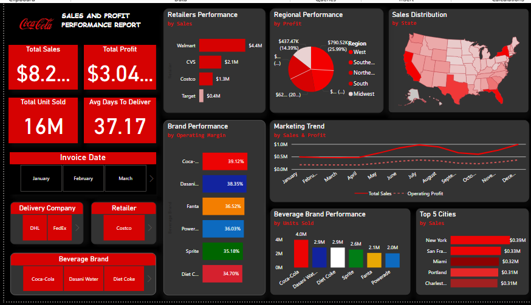

# Sales and Profit Performance Dashboard

This Power BI dashboard provides a comprehensive analysis of sales, profit, and operational metrics for a beverage company, offering insights into brand performance, delivery efficiency, and regional trends.

---

## 📊 Dashboard Features

- **Total Sales and Profit**: Key financial metrics displayed at a glance.
- **Units Sold & Delivery Time**: Visualizes volume metrics and operational efficiency (Avg. Days to Deliver).
- **Sales by Retailer and City**: Breaks down performance across major outlets and cities.
- **Brand Performance**: Compares Coca-Cola, Dasani, Fanta, Sprite, Diet Coke, and Powerade by operating margin and units sold.
- **Regional and State-Level Analysis**: Maps and charts highlight sales and profit contributions by U.S. region and state.
- **Marketing Trend Line**: Tracks monthly trends in total sales and profit.
- **Interactive Slicers**: Filters for Invoice Date, Delivery Company, Retailer, and Beverage Brand.

---

## 📁 Files Included

- `sales-profit-performance-dashboard.png` - Dashboard image preview.

---

## 💡 Tools & Skills Demonstrated

- Power BI
- Data Visualization
- DAX for Custom Measures
- UX-focused Dashboard Design
- Slicer-based Interactivity
- Geo-Spatial Mapping

---

## 🔒 Data Source

The dataset used in this dashboard is gotten from the coca-cola dataset for learning and demonstration purposes.

---

## 📬 Contact

For questions or collaboration opportunities, connect via:
- Email: blessingoladoja22@gmail.com
